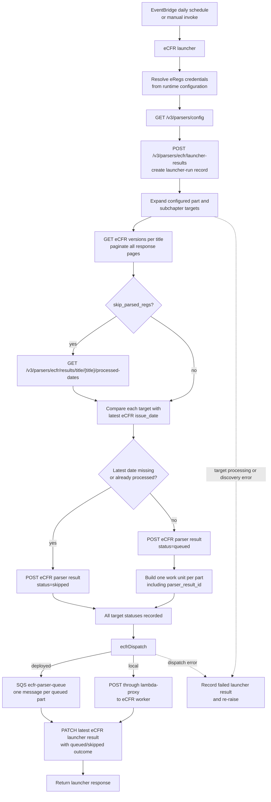
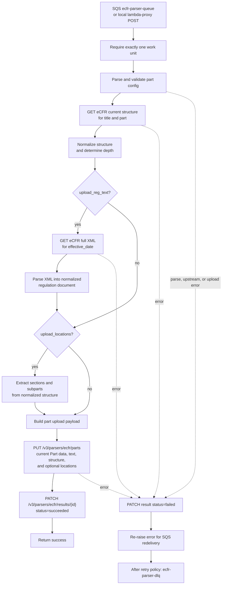
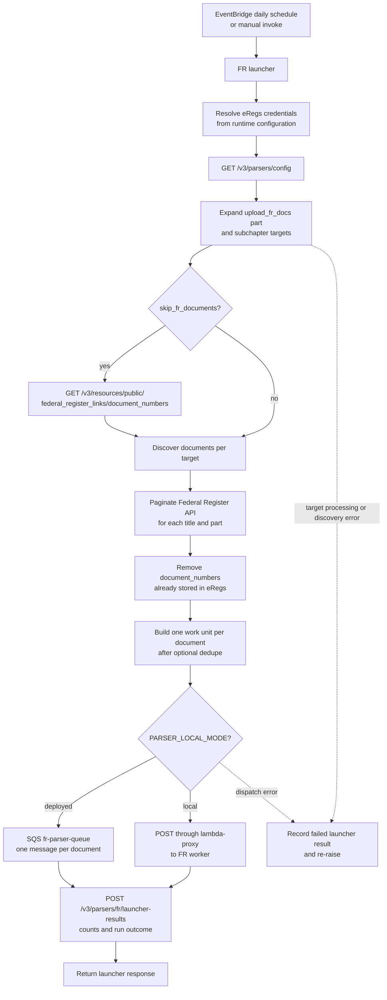
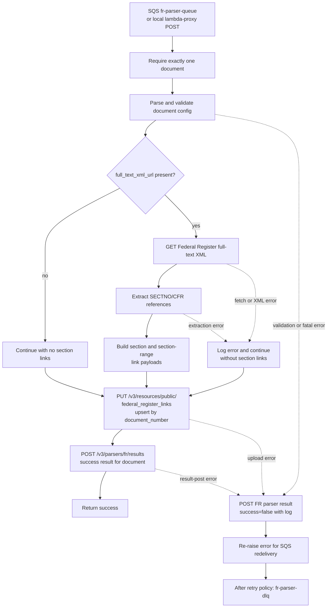

# Parser Lambdas

This directory contains the parser services:

- `ecfr-launcher` and `ecfr-worker`
- `fr-launcher` and `fr-worker`
- `common` shared auth/config/http helpers
- `tests` unit tests for both pipelines

## How the parsers work

Both parser families follow the same split architecture:

- launcher discovers work and creates one work unit per item
- worker consumes exactly one work unit and uploads results to eRegs

Pipelines:

- eCFR: config + title/part discovery -> queue one unit per part -> parse XML/structure -> upload part and locations
- FR: config + Federal Register discovery -> queue one unit per document -> extract section links -> upload Federal Register doc

In local mode (`PARSER_LOCAL_MODE=true`), launchers call workers over HTTP through lambda-proxy. In deployed mode, launchers send to SQS.

## Parser flowcharts

The diagrams below show the deployed flow. In local mode, the launcher-to-SQS edge is replaced by a POST through lambda-proxy to the worker; the worker pipeline is otherwise the same.

<details>
<summary>eCFR launcher flowchart</summary>




The launcher creates the run record before processing targets. Each target gets its own `EcfrParserResult`: skipped targets are terminal immediately, while queued targets carry the result ID that the worker later updates.

</details>

<details>
<summary>eCFR worker flowchart</summary>




The eCFR upload endpoint is also the integration point for saving current regulation data and triggering downstream regulation-text indexing when configured. The parser result row is the per-part status source of truth for last-updated behavior.

</details>

<details>
<summary>Federal Register launcher flowchart</summary>




The FR launcher records its counts-only launcher result after dispatching work. Unlike eCFR, it does not pre-create one parser-result row per document.

</details>

<details>
<summary>Federal Register worker flowchart</summary>




FR section-link extraction is intentionally non-fatal: missing XML or an extraction failure still allows the Federal Register document itself to be upserted. A document upload failure remains fatal so SQS can retry it.

</details>

### eRegs data destinations

| Parser stage | eRegs destination | Purpose |
| --- | --- | --- |
| eCFR launcher | `/v3/parsers/ecfr/launcher-results` | Records each launcher invocation and its outcome. |
| eCFR launcher/worker | `/v3/parsers/ecfr/results` | Records one per-part status row; the worker updates queued rows to succeeded or failed. |
| eCFR worker | `/v3/parsers/ecfr/parts` | Upserts current Part data, regulation text, structure, depth, sections, and subparts according to upload flags. |
| FR launcher | `/v3/parsers/fr/launcher-results` | Records document counts and launcher outcome. |
| FR worker | `/v3/resources/public/federal_register_links` | Upserts Federal Register metadata and extracted section/range links by document number. |
| FR worker | `/v3/parsers/fr/results` | Records one success or failure result per processed document. |

### eCFR flow details

- `ecfr-launcher/app.py` is the entry point and orchestration layer.
- `ecfr-launcher/eregs_config.py` expands parser config targets (`part` + `subchapter`) into concrete title/part work.
- `ecfr-launcher/ecfr_versions.py` resolves the latest `issue_date` per part before queueing.
- `ecfr-worker/app.py` executes one part ingest pipeline per message.
- `ecfr-worker/transforms/` shapes structure payloads and extracts section/subpart location data.
- `ecfr-worker/xml_parser/` parses full eCFR XML into normalized document payloads.

### FR flow details

- `fr-launcher/app.py` orchestrates config fetch, document discovery, dedupe, and dispatch.
- `fr-launcher/fedreg_client.py` handles Federal Register API pagination and document extraction.
- `fr-launcher/frlaunch_config.py` expands `upload_fr_docs` part/subchapter targets.
- `fr-worker/app.py` processes one document at a time, uploads the Federal Register link, then posts a parser result.
- `fr-worker/fedreg_client.py` extracts SECTNO/CFR references from full-text XML.
- `fr-worker/links.py` builds section + section-range payloads for eRegs serializers.

## Directory map

- `ecfr-launcher/`: eCFR discovery and work-unit creation
- `ecfr-worker/`: eCFR parsing + upload pipeline
- `fr-launcher/`: Federal Register discovery, dedupe, and queueing
- `fr-worker/`: Federal Register document processing + upload
- `common/`: shared auth, config, logging, HTTP, queue dispatch
- `tests/`: parser unit tests (run with `make parsers.test`)

Shared modules in `common/` are intentionally thin and reusable:

- `auth.py`: credentials resolution + auth header construction
- `config.py`: strict config/event parsing helpers
- `eregs_client.py`: shared authenticated JSON request helper for parser -> eRegs calls
- `http.py`: request execution + JSON-shape validation wrappers
- `launcher.py`: local-vs-queue dispatch helpers and API-Gateway-style response builder
- `logging.py`: parser log-level normalization and runtime logger configuration
- `ecfr.py` and `fedreg.py`: shared parser-domain helpers and exceptions

## Local development workflow

From `solution/`:

```bash
make parsers.local.build
make parsers.local.up
```

Common commands:

```bash
make parsers.local.invoke.ecfr-launcher
make parsers.local.invoke.fr-launcher
make parsers.local.logs
make parsers.local.down
make parsers.test
```

Local proxy endpoints:

- `ecfr-worker`: `http://localhost:8003`
- `fr-worker`: `http://localhost:8004`
- `ecfr-launcher`: `http://localhost:8005`
- `fr-launcher`: `http://localhost:8006`

Tip: rebuild (`make parsers.local.build`) whenever Dockerfiles, dependencies, or `common/` code changes.

If you are iterating on only Python source (no Dockerfile/dependency changes), `make parsers.local.up` after edits is usually enough because compose bind-mounts parser source directories.

## Key behavior notes

- Workers accept either SQS-style events or lambda-proxy HTTP events.
- Worker credentials are runtime-resolved only: `EREGS_AUTH_SECRET_NAME` -> `EREGS_BEARER_TOKEN` -> `EREGS_USERNAME`/`EREGS_PASSWORD`.
- Launchers resolve log level from parser config and include it in worker work units.
- FR dedupe is controlled by parser config (`skip_fr_documents`) using existing `document_number` values in eRegs.
- FR section-link extraction is non-fatal: a document still uploads even if link extraction fails.

Additional contracts to keep in mind:

- eCFR worker status rows are part-level and transition monotonically toward success (`queued/failed -> succeeded` allowed; terminal statuses are not downgraded).
- FR worker upserts Federal Register documents by `document_number` through the resources endpoint.
- Parser result APIs under `/v3/parsers/` are part of the runtime contract for launcher/worker observability.

## Practical debugging tips

- If local launcher runs enqueue `0/N`, check `PARSER_LOCAL_MODE`, `PARSER_WORKER_URL`, and worker logs first.
- If eCFR launcher skips too much (or nothing), inspect `/v3/parsers/config` and `/v3/parsers/ecfr/results/title/<title>/processed-dates` responses.
- If FR uploads succeed but results fail, check `/v3/parsers/fr/results` validation errors in backend logs.

Quick places to start when debugging code:

- Launcher orchestration bugs: `ecfr-launcher/app.py` or `fr-launcher/app.py`
- Config expansion issues: `ecfr-launcher/eregs_config.py` or `fr-launcher/frlaunch_config.py`
- Worker upload payload issues: `ecfr-worker/eregs_client.py` or `fr-worker/eregs_client.py`
- Shared transport/auth behavior: `common/http.py`, `common/eregs_client.py`, `common/auth.py`

## Manual invoke (optional)

Most development should use `make parsers.local.invoke.*`. Manual invoke is useful for targeted debugging:

```bash
curl -s -X POST http://localhost:8005 -H 'Content-Type: application/json' -d '{}'
curl -s -X POST http://localhost:8006 -H 'Content-Type: application/json' -d '{}'
```

To invoke workers directly, POST a JSON body with a `config` object matching each worker's expected payload schema. Use this sparingly; launcher-driven invocation better matches production behavior.
